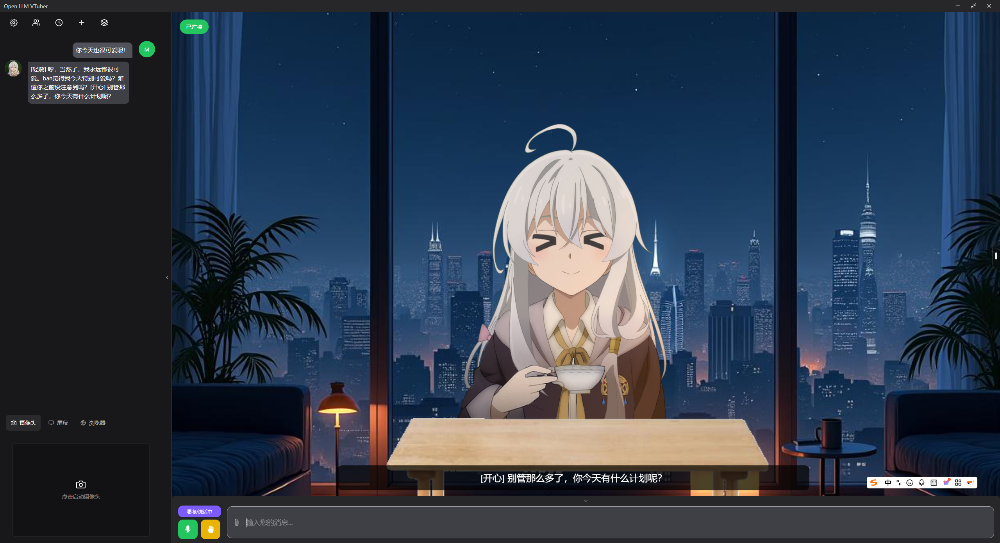
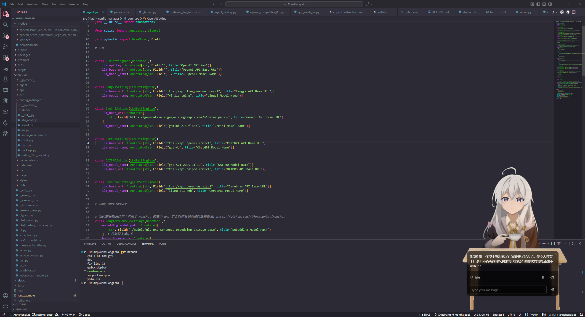
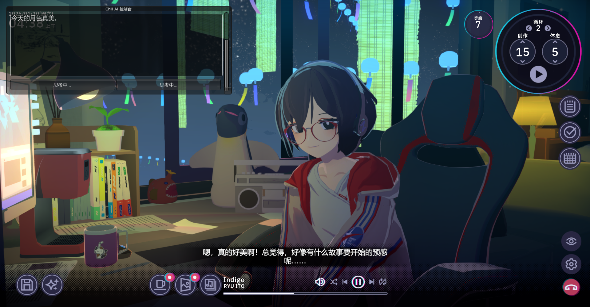
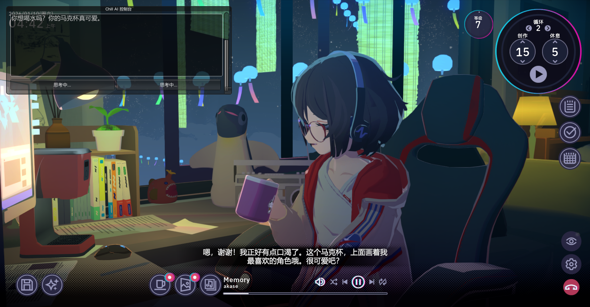

  

<h1 align="center">XnneHangLab</h1>
</a>
 

 

 魔女の实验室

<a href='https://lab.xnnehang.top/' style='font-size: 20px;'><strong>文档网站</strong></a> ·
<a href='https://space.bilibili.com/556737824'><strong>bilibili视频教程(再等等噢)</strong></a>

 

## ✨它为什么诞生

这里是绘心，专注于 AI 桌宠的实验室。

**tts/sts 数据集制作:** 音频字幕生成 -> 自动裁剪音频 -> 响度匹配 -> 降噪 -> 字幕再次生成

**tts/sts 微调和语音生成:** 兼容 GPT-SoVITS ，把它做成 FastAPI 服务，用于各种我需要的地方。

## 🧙‍♀️为什么叫魔女の实验室

我在写这个项目的时经常想到伊蕾娜她小时候认真学习魔法的样子。

我大概也是以那种心态在写这个项目吧。不知道后面能不能直接把这个当毕设了。

## 👀效果演示

|  |  |
| :---: | :---: |
|  |  |

## ✅功能清单

- [x] **与 LLM 驱动的 Live2d 对话**: 可以替换 [Open-LLM-VTuber](https://github.com/Open-LLM-VTuber/Open-LLM-VTuber)的后端使用，在这里进行了一些 MCP 和 Long Term Memory 的实验。
- [x] **为《Chill with You Lo-Fi Story》提供 TTS 服务**: 可以为 [qzrs777/AIChat](https://github.com/qzrs777/AIChat)提供兼容的GPT-SoVITS 兼容服务，实现全语音回复。

## 🛠️本地部署

参见 [部署指南](https://lab.xnnehang.top/guide/deploy)

## ⚙️配置

參見 [配置说明](https://lab.xnnehang.top/guide/settings)

## 📦引用的仓库

- [**Open-LLM-VTuber-Web**:The Web/Electron frontend for Open-LLM-VTuber Project](https://github.com/Open-LLM-VTuber/Open-LLM-VTuber-Web)
- [**FunASR:** A Fundamental End-to-End Speech Recognition Toolkit and Open Source SOTA Pretrained Models, Supporting Speech Recognition, Voice Activity Detection, Text Post-processing etc.](https://github.com/modelscope/FunASR?tab=readme-ov-file)
- [**Streamlit** — A faster way to build and share data apps.](https://github.com/streamlit/streamlit)
- [**Chenyme-AAVT:** 这是一个全自动（音频）视频翻译项目。利用Whisper识别声音，AI大模型翻译字幕，最后合并字幕视频，生成翻译后的视频。](https://github.com/Chenyme/Chenyme-AAVT)
- [**qzrs777/AIChat:** 为《Chill with You Lo-Fi Story》添加基于 LLM + VITS + ASR 的 AI 全语音对话（BepInEx 插件），让游戏角色支持实时语音与表情动作联动。](https://github.com/qzrs777/AIChat)

## 🤝如何参与到开发:

详细参见： [CONTRIBUTING.md](https://github.com/XnneHangLab/XnneHangLab/blob/dev/CONTRIBUTING.md)

非常欢迎各位以任何形式的贡献，包括， bug 反馈，使用体验优化，第三方库和模型更新提醒，合理有益的功能需求等等。
