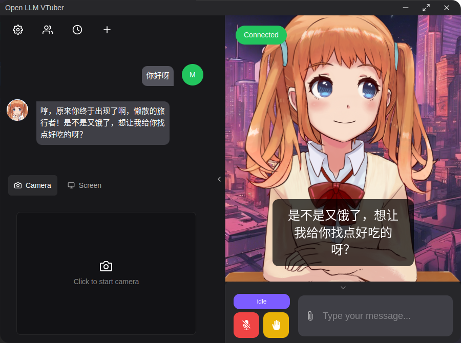
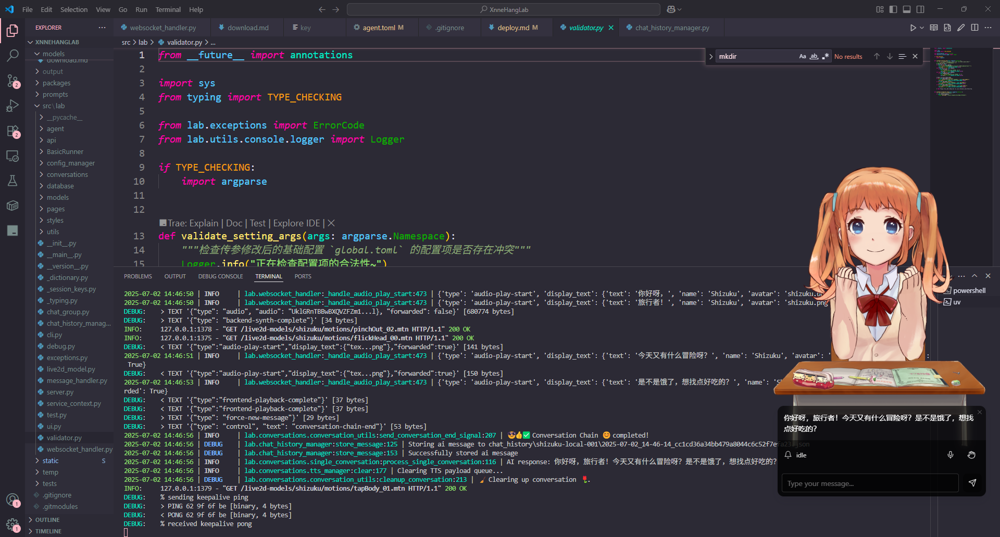

<a href="https://xnnehang.top/">

    

<h1 align="center">XnneHangLab</h1>
</a>
 

 

 <a href="./README_en.md"><b>English Documentation </b></a> 

 魔女の实验室

<a href='https://xnnehang.top/' style='font-size: 20px;'><strong>文档网站(等等噢)</strong></a> ·
<a href='https://space.bilibili.com/556737824'><strong>bilibili视频教程(再等等噢)</strong></a>

  <a href="#功能"><strong>功能</strong></a> ·
  <a href="#演示"><strong>演示</strong></a> ·
  <a href="#本地部署"><strong>本地部署</strong></a>
  <a href="#fastapi&cli"><strong>fastapi&cli</strong></a> ·
  <a href="#配置"><strong>配置</strong></a>

 

## 它为什么诞生

我对它的期望是一个满足我日常音频所需的完整的工作流，主要有:

**做视频:** 视频字幕生成 -> 视频字幕速度调节和编辑 -> 字幕内嵌或者导出

**啃生肉提高日语水平** b站视频下载 -> 视频字幕生成 -> 视频字幕翻译

**tts/sts 数据集制作:** 音频字幕生成 -> 自动裁剪音频 -> 响度匹配 -> 降噪 -> 字幕再次生成

**tts/sts 微调和语音生成:** 可能会把以前玩过的 Bert-ViTS2 集成进来，同样，也是做视频用。

## 为什么叫魔女の实验室

我在写这个项目的时经常想到伊蕾娜她小时候认真学习魔法的样子。

我大概也是以那种心态在写这个项目吧。不知道后面能不能直接把这个当毕设了。

## 功能

- [**待办事项：** A To-Do-List Built by Streamlit.](https://github.com/MrXnneHang/Streamlit-To-Do-List?tab=readme-ov-file)

由于我总是忘记之后要什么，所以做了一个 To-Do-List 来提醒自己。分短期和长期任务，长期任务也可以作为 RoadMap。

- [**字幕生成（本地运行）:** 基于 Funasr, 支持热词，支持字幕速度调节和编辑](https://xnnehang.top/posts/software/Auto_Caption_Generater_Offline_v2_4)

- [**VTuberLab BackEnd**: Live2d + LLM + ASR + TTS 的对话引擎。](docs/vtuber.md)

- [**yutto-uiya:** 一个 bilibili 视频下载器，基于 yutto 开发的 WebUI](https://github.com/XnneHangLab/yutto-uiya)

使用方法类似于 Downkyi, 致力于从视频下载到音频处理以及字幕生成一条龙服务。

## fastapi&cli

你也可以把该项目作为后端, 它使用 [**FastAPI**](https://fastapi.tiangolo.com/) 提供了部分功能, 具体参考 [fastapi](./docs/fastapi.md) 文档。

该项目也正在开发 cli 工具, 目前支持音频识别和语音活动检测, 具体参考 [cli](./docs/cli.md) 文档。

> 写前端后端混合让我感到稀碎和结构混乱, 反而 cli 有助于理解项目结构? 简单说就是更爽.

## 演示

[从我的网站访问: **fast.xnnehang.top**](https://fast.xnnehang.top)

> 如果你发现网站不在线,那么可能是节假日我在家打游戏把它关了 =-=.

我用 frp 和 一个外国的服务器把该项目部署到了我家的台式机并且可以通过网站访问。你可以在这里轻度体验。

下面是一些截图。

### 实验性:

VtuberLab 的内容正在开发中。目前已经兼容 Open-LLM-VTuber 的前端。

具体内容和更新参见: [vtuber.md](./docs/vtuber.md)

## 本地部署

参见 [deploy.md](./docs/deploy.md)

## 配置

參見 [settings.md](./docs/settings.md)

## RoadMap

- [ ] SenseVoice with TimeStamp 模型选项支持
- [ ] 视频识别模块
- [x] yutto-uiya 的移重构 bilibili 视频下载 new package

> 最近 all in vtuberlab 了。

- [ ] 给散乱的关于 VTuber 功能的 configs 做一个配置页面。
- [ ] 番茄钟定时功能。让 VTuber 提醒我休息一下。
- [x] 接入 Gemini API.
- [ ] 重构 Sentence_Divider, 仅当积攒了一定数量的字符后才会开始发送 tts 请求。
- [ ] 在 Tool Call 的时候让模型回复一些东西来作为消息，而不是一直等待。

## 引用的仓库

- [**Open-LLM-VTuber-Web**:The Web/Electron frontend for Open-LLM-VTuber Project](https://github.com/Open-LLM-VTuber/Open-LLM-VTuber-Web)
- [**FunASR:** A Fundamental End-to-End Speech Recognition Toolkit and Open Source SOTA Pretrained Models, Supporting Speech Recognition, Voice Activity Detection, Text Post-processing etc.](https://github.com/modelscope/FunASR?tab=readme-ov-file)
- [**Streamlit** — A faster way to build and share data apps.](https://github.com/streamlit/streamlit)
- [**yutto:** 🧊 一个可爱且任性的 B 站视频下载器](https://github.com/yutto-dev/yutto)
- [**Chenyme-AAVT:** 这是一个全自动（音频）视频翻译项目。利用Whisper识别声音，AI大模型翻译字幕，最后合并字幕视频，生成翻译后的视频。](https://github.com/Chenyme/Chenyme-AAVT)

## 如何参与到开发:

详细参见： [CONTRIBUTING.md](https://github.com/XnneHangLab/XnneHangLab/blob/dev/CONTRIBUTING.md)

非常欢迎各位以任何形式的贡献，包括， bug 反馈，使用体验优化，第三方库和模型更新提醒，合理有益的功能需求等等。
