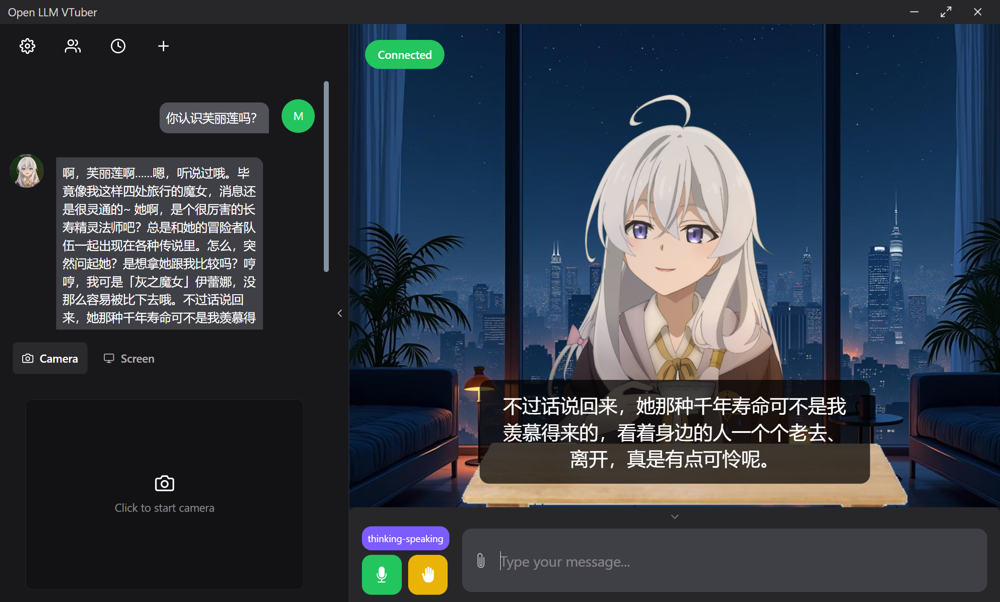
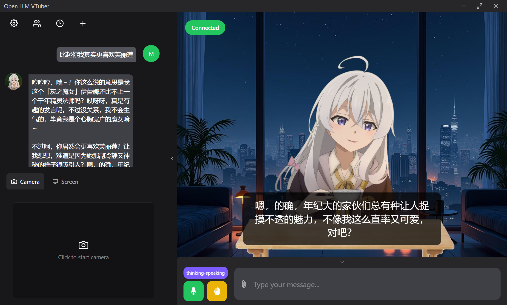

# VtuberLab 实验性

## 演示





## 启动

**对于后端**:

你需要完成环境预配置，然后在本项目的根目录运行:

```shell
just server
```

**对于前端**:

```shell
git clone https://github.com/XnneHangLab/Open-LLM-VTuber-Web.git
cd Open-LLM-VTuber-Web
npm install
npm run dev
```


## 做了什么？

目前版本中从 [Open-LLM-VTuber](https://github.com/Open-LLM-VTuber/Open-LLM-VTuber) 处移植了相当多代码来与前端兼容：

新增:
 - 增加了 BERT-VITS2.3 推理中文。
 - 使用 [fast_gsv](https://github.com/XnneHangLab/GPT-SoVITS-Inference#) 推理 GPT-SoVITS, 模型使用的是 [b 站某个佬训练的](https://www.bilibili.com/video/BV1Df421m7bm/).
  
https://github.com/user-attachments/assets/92715937-f1b0-4828-a89b-35569bc3026e


阉割:
- group chat 功能, 因为会需要维护很多我用不到的代码
- HumanAI. 仅保留 Basic Memory Agent 与 StateLess LLM. 保证扩展性。
- 暂时只支持 openai sdk，之后会接入 Gemini, 但除了这些外应该不会接入其他的 LLM。
- ASR 仅使用已有的 FunASR。
- Translate 仅使用 deeplx
- 在 prompt 的方面仅仅使用了 system prompt. 位于 `prompts/` 下.


目前在已有功能上无缝兼容 [Open-LLM-VTuber-Web](https://github.com/Open-LLM-VTuber/Open-LLM-VTuber-Web)，我就是为了这醋包的饺子。它的 Web-窗口-桌宠模式让我可以不需要写前端代码。


## 计划

用 gemini API 配合 Langgraph 手搓实现一个能多模态交互的桌宠。

从别的仓库借鉴想法:

- [我会从这样借鉴它的 long term memory 的想法: **MoeChat:一个超低延迟的基于GPT-SoVITS语音合成的语音交互系统**](https://github.com/AlfreScarlet/MoeChat)
- [我会从这里借鉴桌宠的交互以及多模态的接入：**my-neuro:This project lets you create your own AI desktop companion with customizable characters and voice conversations that respond in just 1 second. Features include long-term memory, visual recognition, voice cloning and LLM training. Compatible with various Live2D customizations.**](https://github.com/morettt/my-neuro)
- 桌宠的语音唤醒与持续互动，从目前的结构来看是可实现的，因为原项目的 VAD 中使用了`send_text(json.dumps({"type": "control", "text": "mic-audio-end"}))`来停止语音输入。那么我也可以自定义发送 `mic-audio-start` 来开启麦克风。

我想实现的是，一个可以长时间陪伴我 coding 的 waifu。可以在我写代码之余聊聊天，或者在我写错时调侃我。

我需要做的是， keep it simple and go further.
